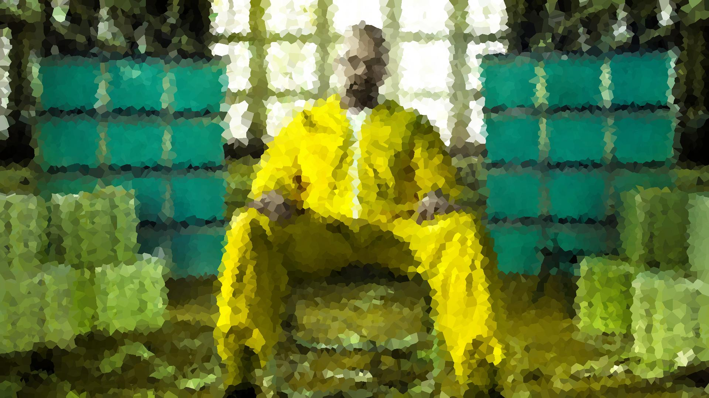

**Important**.
For the android course, you are required to solve **1 of the 3** tasks given.
This is task3.

### The What?

[This](http://www.lunapic.com/editor/premade/stained-glass.gif) was generated using [this](http://www170.lunapic.com/editor/?action=stained-glass).
We need you to do better. No web interface, no black outlines and flexibility as to how the polygons are to be generated.

### The How?

This task was inspired by the famous [Voronoi diagram](http://www.personal.kent.edu/~rmuhamma/Compgeometry/MyCG/CG-Applets/Images/vor_overlay_eg02.gif).  

There is a set of points on a 2D plane. Those points are centers of respective regions(1 region per point). Let's call those points the *center points*.  

Every *center point* has one *region* surrounding it, and every *region* has one *center point*.  

How are the regions of the *center points* determined? If you take any point from a region, let's say point *A* you will notice that the closest *center point* to A is the center point of the region from where A originates.  
This means that in order to determine which point is contained in which region all you have to do is find the nearest center point to that point. This is the way to do this filter. 

Given an input image, generate a number of *center points* and determine the *region* for every pixel in the input image.   
Calculate the average color from all pixels belonging in a certain region, and draw every pixel in that region in the averaged color.

See? Simple.

**Note:** Finding the closest point to another point is easy but the naive approach takes O(N) time. Use [K-D trees](http://en.wikipedia.org/wiki/K-d_tree) to reduce the complexity to O(log(N)).
You can use any java library or code you want. Personally I used literary the [first google result](http://home.wlu.edu/~levys/software/kd/) that popped out on my first search.
K-D trees are simple so any library is as good as the next, so don't worry about it ;)

### The Formalaties!

Write a Java command line tool that takes one image as input and outputs that image with stained glass effect applied to it.
Add an optional argument that determines how many regions the output image will be comprised of.
For example `java stainedGlassFilter input.jpg output.jpg 10000`

### The Goal!
**Example input**

**Example output**

